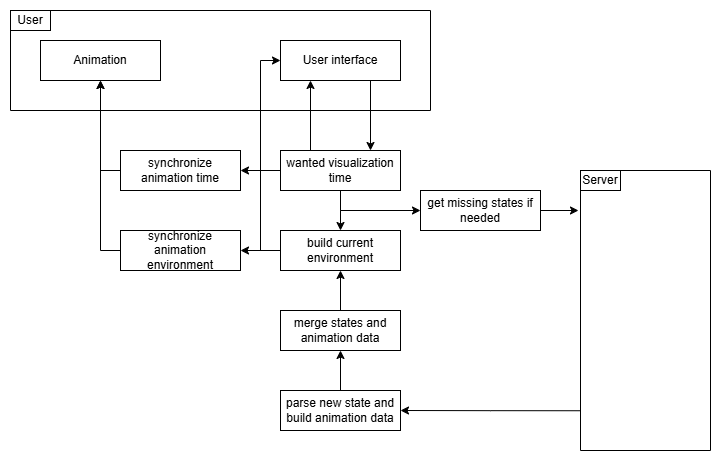

# Multimodal Simulation Visualization

This project is an extension of the packaged [multimodal-simulation](https://github.com/lab-core/multimodal-simulator) designed to offer a visualization interface for the simulation results. The frontend is built with Angular and uses [Leaflet](https://leafletjs.com/) as well as [Leaflet.PixiOverlay](https://github.com/manubb/Leaflet.PixiOverlay) to animate the simulation results on a map. The backend is built with Flask and uses Flask-SocketIO to communicate with the frontend, and also handle the data extraction process.

- [Multimodal Simulation Visualization](#multimodal-simulation-visualization)
  - [Folder structure](#folder-structure)
    - [`data`](#data)
    - [`multimodal_simulator`](#multimodal_simulator)
  - [Installation](#installation)
    - [Angular](#angular)
    - [Python](#python)
      - [Windows](#windows)
      - [Linux / MacOS](#linux--macos)
    - [Building the Frontend](#building-the-frontend)
    - [Changing Ports](#changing-ports)
  - [Frontend](#frontend)
    - [Wanted visualization time](#wanted-visualization-time)
    - [Data reception](#data-reception)
    - [Display](#display)
  - [Backend](#backend)
    - [Key insights](#key-insights)
    - [Components](#components)
      - [`server.py`](#serverpy)
      - [`server_utils.py`](#server_utilspy)
      - [`http_routes.py`](#http_routespy)
      - [`simulation_manager.py`](#simulation_managerpy)
      - [`simulation_visualization_data_collector.py`](#simulation_visualization_data_collectorpy)
      - [`simulation_visualization_data_model.py`](#simulation_visualization_data_modelpy)
      - [`simulation.py`](#simulationpy)
  - [Known issues and limitations](#known-issues-and-limitations)

## Folder structure

This repository is structured as follows:

```bash
├── multimodal_server # Backend Flask application
├── multimodal_ui # Compiled Angular application
├── multimodal-ui # Frontend Angular application
├── multimodal-simulator # Submodule containing the multimodal-simulator package
├── data # Source data for the simulation
```

### `data`

Source data folders are available in the `data/` folder to run simulations. Only a restricted number of source data are provided with the Github repository because some data are too large to be uploaded on Github.

### `multimodal_simulator`

The `multimodal-simulator` submodule is available in the `multimodal-simulator` folder. When updating your local repository, you can use the following command to update the submodule :

```bash
# Should be run in the root of the repository
git submodule update --init --recursive
cd multimodal-simulator
git checkout develop-visualizer
git pull origin develop-visualizer
```

## Installation

This project is built with Python and Angular. You have several options to run the project. You can either use `docker-compose` to run the project in a containerized environment, you can use Python to run the project locally and deploy the frontend, and finally you can also run the frontend using `npm`.

### Angular

To run the frontend, you need to install Node.js and npm. The application has been developed with Node.js v22. You can then install the dependencies with the following command in the `multimodal-ui` folder:

```bash
npm install
```

You can then run the application with the following command:

```bash
npm start
```

The port is defined in the `.env` file. By default, it is set to `8085`. You can change it to any other port you want. Because of this customization, you will have to use the scripts defined in the `package.json` file (`npm start`) to run the application. Using `ng serve` will not work properly.

### Python

This project is currently built with Python 3.11. To make the installation easier, you should use a Python virtual environment. You can use the following scripts depending on your operating system.

##### Windows

```bash
py -3.11 -m venv venv
.\venv\Scripts\activate
```

##### Linux / MacOS

```bash
python3 -m venv venv
source venv/bin/activate
```

To exit the virtual environment, you can use the `deactivate` command.

The following script will setup the virtual environment.

```bash
# Should be run in the root of the repository in a python virtual environment

# Upgrading pip
python -m pip install --upgrade pip

# Updating submodule
git submodule update --init --recursive
cd multimodal-simulator
git checkout develop-visualizer
git pull origin develop-visualizer

# Installing the submodule package
cd python
python -m pip install -r requirements.txt
python setup.py install

# Installing the project package
cd ../..
python -m pip install -e .
```

Now that the python environment is set up, you can run the following command to run the server:

```bash
multimodal-server
```

You can also deploy the frontend with the following command:

```bash
multimodal-ui
```

### Building the Frontend

If you made changes to the frontend, you might want to rebuild it to be able to run it without Angular later.

```bash
cd multimodal-ui
npm run build
```

Once the build is finished, copy the contents of `multimodal-ui/dist/multimodal-ui/browser/` into `multimodal_ui/static/`.

This process can be done automatically when developing using the provided GitHub action `Build`. You can run it on the branch of your choice in the Actions tab of the repository.

### Changing Ports

The ports are defined in the .env file. After changing them, restart both the front and the back ends for the changes to take effect.

If you are running the app through the python package or inside a docker container and do not wish to rebuild it with angular, you will also have to change the ports directly in the build.
In the `/multimodal_ui/static/main-XXXXXXXX.js` file, locate this section:
`socketUrl:"http://127.0.0.1:8089",apiUrl:"http://127.0.0.1:8089/api/",clientPort:8085`
and replace the ports to match the ones you redefined in your .env file.

Reinstall the Python package for good measure.

If you are running it in docker, you will have to rebuild it with `docker-compose up --build`

## Frontend

The frontend contains three main components: the map, the user interface, and the environment build. In this section, we will focus on the last one.



Before going into the details of the environment builder, we need to explain a few important concepts. In the server, the simulation is saved as a series of states. Each state is a snapshot of the simulation at a given time, and contains a list of updates that, when applied to the state, will reconstruct the simulation at any given time.

Another important concept is the animation data used for the animations on the map. Each entity has a list of animation data that contains the information to display the entity at any given time. It contains all the information needed to find the position, the color, the orientation or the path.

### Wanted visualization time

As you can see, the central logic part is the wanted visualization time. This value is incremented or decremented periodically according to the speed and the direction of the visualization, can be directly changed by the user in the interface, and is limited by the simulation start and end time.

The wanted visualization time is the target that the system tries to reach. If the simulation states are not available for the wanted visualization time, the system will fetch new states from the server and wait for them to be available. When the simulation states are available, the system will build the visualization environment and the visualization will be updated.

### Data reception

When the server responds to the client state request, the client will receive a list of new simulation states. Each state needs to be parsed and verified, and a continuous structure is created that will be used for the animation. We refer to this structure as the animation data.

Once all new states are ready, we will merge the new states and animation data with the current ones in the client. Because the states already loaded in the client can be scattered all over the simulation, the server sends additional information to help the client extract the largest possible continuous list of states around the wanted visualization time. The client can then use this to merge the animation data of those continuous states and create a unified animation data.

### Display

Once the animation states and data are ready, and the environment for the wanted visualization time is built, the user interface will be updated and the map animation will be synchronized. The environment is used to display information in the user interface such as the control bar, the left panel with the statistics and the entities, and the utility features on the right.

The map animation is done using the animation data. For each frame, the animation will find the current animation data for each entity and can quickly update the map.

## Backend

The server has several goals in this project. It handle the instanciation of simulations, the data extraction process and the communication with the frontend. In this section, we will explain how the server works and what are the different components.

### Key insights

It's worth noting that two types of processes coexist in the server. The first one is the communication hub process, defined in `server.py`, that will handle the communication with the frontend and the other processes. The second one is the simulation process, defined in `simulation_visualization_data_collector`, that will handle the simulation and the data extraction process. The hub process will only read the data from the simulation processes and each simulation process will write in a specific file, allowing several optimizations in a multiple readers / single writer architecture.

### Components

##### `server.py`

This file contains the main function `run_server` of the communication hub. All socket communications are defined in this file and the server state is handled here.

##### `server_utils.py`

This file contains all global constants and utility functions used in the server.

##### `http_routes.py`

This module contains the HTTP routes used to communicate with the frontend. Those HTTP routes are used to manage the file import, export and delete operations.

##### `simulation_manager.py`

This module defines the `SimulationManager` class that will handle the state of each simulation available, running or saved, in the server. It will also handle the communication with the frontend and the simulation processes along with the process instanciation and termination.

##### `simulation_visualization_data_collector.py`

This module provide a `DataCollector` for the data extraction and the simulation-server communication. A `DataCollector` is a component of the multimodal-simulator that is called after each event processed. It is used to extract the data from the simulation save it and notify the server.

When initialized, the `DataCollector` will configure the communications and create an initial `VisualizedEnvironment` object that will represent the simulation environment.

During the simulation, the `collect` method is called and handle every event processed. It will extract the data from the simulation and create multiple updates that will be saved along the environment to be able to reconstruct every moment of the simulation.

##### `simulation_visualization_data_model.py`

This module centralized every read and write operation on the simulation data. Each useful component of multimodal-simulator has a corresponding data model that will be used to serialize or deserialize the data and construct it from the original components.

The `SimulationVisualizationDataModel` class is a static class where all read and write operations will pass through. It will guarantee the absence of concurrent access.

##### `simulation.py`

This module contains the function called by the communication hub when instantiating a simulation process from the frontend. It also provide a CLI to run the simulation process without the frontend.

## Known issues and limitations

A list of the current issues and limitations of this projects can be found in the issues section of the repository. Feel free to open an issue if you encounter any problems or if you have any suggestions for improvements.
