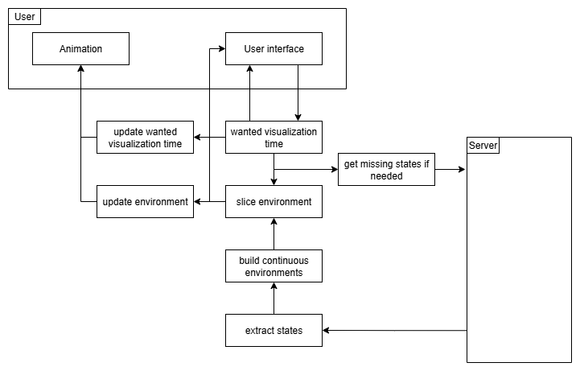

# Multimodal Simulation Visualization

This project is an extension of the packaged [multimodal-simulation](https://github.com/lab-core/multimodal-simulator) designed to offer a visualization interface for the simulation results. The frontend is built with Angular and uses [Leaflet](https://leafletjs.com/) as well as [Leaflet.PixiOverlay](https://github.com/manubb/Leaflet.PixiOverlay) to animate the simulation results on a map. The backend is built with Flask and uses Flask-SocketIO to communicate with the frontend, and also handle the data extraction process.

- [Multimodal Simulation Visualization](#multimodal-simulation-visualization)
  - [Installation](#installation)
  - [Publication to PyPI](#publication-to-pypi)
    - [Using Docker to publish](#using-docker-to-publish)
    - [Using GitHub Actions to publish](#using-github-actions-to-publish)
  - [Development](#development)
    - [Angular](#angular)
    - [Python](#python)
    - [Docker](#docker)
    - [Lint and formatting](#lint-and-formatting)
    - [Building the Frontend](#building-the-frontend)
    - [Changing Environment Variables](#changing-environment-variables)
  - [Input And Output Data](#input-and-output-data)
  - [Environment variables](#environment-variables)
  - [Frontend](#frontend)
    - [Wanted visualization time](#wanted-visualization-time)
    - [Data reception](#data-reception)
    - [Display](#display)
    - [Continuous environments](#continuous-environments)
    - [Tasks](#tasks)
  - [Backend](#backend)
    - [Key insights](#key-insights)
    - [Components](#components)
      - [Models](#models)
      - [`server.py`](#serverpy)
      - [`server_utils.py`](#server_utilspy)
      - [`http_routes.py`](#http_routespy)
      - [`simulation_manager.py`](#simulation_managerpy)
      - [`data_collector.py`](#data_collectorpy)
      - [`data_manager.py`](#data_managerpy)
      - [`simulation.py`](#simulationpy)
  - [Known issues and limitations](#known-issues-and-limitations)

## Installation

You have access to several commands that will allow you to run the project easily.

```bash
viewer start 
viewer start --ui     # only start the UI side
viewer start --server # only start the server 

viewer stop
viewer stop --ui     # only stop the UI side
viewer stop --server # only stop the server
```

You can also run a simulation from the command line. Several arguments are available to customize the simulation and can be found with the --help option, but the required arguments will be asked interactively if not provided. The command to run a simulation is:

```bash
viewer simulate
```

## Publication to PyPI

To publish this project, you need to have the `build` and `twine` packages installed. You can install them with the following command:

```bash
python -m pip install --upgrade build twine
```

Then, you need to build the project. You also need to set the `PYTHON_PACKAGE_VERSION` environment variable to the version you want to publish.
 
```bash
PYTHON_PACKAGE_VERSION='0.0.1' python -m build
```

To publish the project to PyPI, you can use the following command:

```bash
python -m twine upload --repository pypi ./dist/* --verbose
```

If you want to publish but not affect the main index of PyPI, you can publish the project to TestPyPI:

```bash
python -m twine upload --repository testpypi ./dist/* --verbose
```

If you want to test the TestPyPi publication, you can install the package from TestPyPI with the following command:

```bash
python -m pip install --index-url https://test.pypi.org/simple/ --extra-index-url https://pypi.org/simple multimodalsim-viewer==0.0.1
```

### Using Docker to publish

Docker scripts are also available to build and publish the project without having to install Python or Node.js. You can use one of the following commands:

```bash
# To only build the angular application
docker compose --profile build-angular up --build --force-recreate

# To build the angular application and publish it to PyPI or TestPyPI
PYTHON_PACKAGE_VERSION='0.0.1' docker compose --profile publish up --build --force-recreate
PYTHON_PACKAGE_VERSION='0.0.1' docker compose --profile publish-test up --build --force-recreate

# To only publish the package to PyPI or TestPyPI without building the angular application
PYTHON_PACKAGE_VERSION='0.0.1' docker compose --profile publish-only up --build --force-recreate
PYTHON_PACKAGE_VERSION='0.0.1' docker compose --profile publish-test-only up --build --force-recreate
```

### Using GitHub Actions to publish

You can also use the provided GitHub Actions to build and publish the project. These actions are triggered when a new tag is pushed to the repository on a commit on the `main` branch. The tag should follow on of the following formats (where the x's are numbers):
- `vx.x.x` 
- `vx.x.x.x`
- `vx.x.x-test` (for TestPyPI)
- `vx.x.x.x-test` (for TestPyPI)

## Development

This project is built with Python and Angular. You have several options to run the project. You can either use `docker-compose` to run the project in a containerized environment, you can use Python to run the project locally and deploy the frontend, and finally you can also run the frontend using `npm`.

### Angular

To run the frontend, you need to install Node.js and npm. The application has been developed with Node.js v22. You can then install the dependencies with the following command in the `multimodal-ui` folder:

```bash
npm install
```

You can then run the application with the following command:

```bash
npm start
```

The port is defined in the `.env` file. By default, it is set to `8085`. You can change it to any other port you want. Because of this customization, you will have to use the scripts defined in the `package.json` file (`npm start`) to run the application. Using `ng serve` will not work properly.

### Python

To make the installation easier, you should use a Python virtual environment. You can use the following scripts depending on your operating system.

```bash
# For Windows
py -3.13 -m venv venv # You can take the version you want
.\venv\Scripts\activate

# For Linux / MacOS
python3 -m venv venv
source venv/bin/activate
```

To exit the virtual environment, you can use the `deactivate` command.

The following script will setup the virtual environment.

```bash
# Should be run in the root of the repository in a python virtual environment

# Upgrading pip
python -m pip install --upgrade pip

# Installing the project package
cd python
python -m pip install -e . 
```

Now that the python environment is set up, you can run the commands specified in the [installation](#installation) section.

### Docker

Alternatively, you can use Docker to run the project. A `docker-compose.yml` file is provided in the root of the repository and contains two jobs to setup containers with the required environment to run the project.

You can run these containers with the following command:

```bash
# Frontend
docker compose -f docker-compose.dev.yml up --build angular-dev

# Backend
docker compose -f docker-compose.dev.yml up --build python-dev
```

You can also run the entire project with the following command:

```bash
docker compose up --build python-prod
```

### Lint and formatting

The angular code is formatted using Prettier and linted using ESLint. The following commands are available in the `multimodal-ui` folder:

```bash
npm run lint         # Detect linting errors
npm run format:check # Detect formatting errors
npm run format       # Format the code
```

The python code is formatted using Black, linted using Pylint and an additional library Isort is used to organize the imports. After installing all dev dependencies, you can run the following commands in the `python` folder:

```bash
python -m pip install --upgrade -r requirements.dev.txt

python -m pylint . # Detect linting errors
python -m black .  # Format the code
python -m isort .  # Organize the imports
```


### Building the Frontend

If you made changes to the frontend, you might want to rebuild it to be able to run it without Angular later.

A docker script is available to build the frontend without having to install Node.js or npm. You can use the following command:

```bash
docker compose --profile build-angular up --build --force-recreate
```

If you want to build the frontend manually, you can do so by running this command in the `multimodal-ui` folder:

```bash
npm run build
```

Once the build is finished, copy the contents of `multimodal-ui/dist/multimodal-ui/browser/` into `python/multimodalsim_viewer/ui/static/`. This will allow the Python package to serve the built frontend.

This process can also be done using the provided GitHub action `Build`. You can run it on the branch of your choice in the Actions tab of the repository.

### Changing Environment Variables

Some variables, such as the client and server ports, are defined in an environment file.

The `.env` file in the root folder of the repository defines the default environment variables that will be used by the built application. You can create a `.env` file in the folder from which you run the application (CWD), and it will override the default values.

After changing them, you will need to restart all processes for the changes to take effect.

We strongly recommend to use `npm start` and `npm run build` and/or the provided docker scripts to run the application, as they will automatically load the correct environment.

## Input And Output Data

To run a simulation, you need to provide input data. You can upload input data folders through the web interface. Some basic input data folders are available in the `data` submodule. You can update the submodule contents with the following command:

```bash
git submodule update --init --recursive
```

If you want to use another folder containing input data folders, you can either upload each input data folder through the web interface or you can set the path to the input data folder when running the application with the `INPUT_DATA_DIRECTORY_PATH` environment variable. This path will be used to load the input data folders when running the application and to save the uploaded input data folders.

You can set the `OUTPUT_DATA_DIRECTORY_PATH` environment variable as well to specify the path to the output data folder. This path will be used to save the output data generated by the application, namely the visualization files and the logs.

## Environment variables 

The application uses several environment variables to configure its behavior. You can set these variables in a `.env` file in the root folder of the repository, or you can set them directly in your environment.

The most useful environment variables are `CLIENT_PORT`, `SERVER_PORT`, `INPUT_DATA_DIRECTORY_PATH`, and `OUTPUT_DATA_DIRECTORY_PATH`.

- `CLIENT_PORT` (default `8085`): The port on which the client will run. 
- `SERVER_PORT` (default `8089`): The port on which the server will run.
- `SIMULATION_SAVE_FILE_SEPARATOR` (default `---`): The separator used in the simulation save files.
- `INPUT_DATA_DIRECTORY_PATH` (default `data`): The path to the input data directory.
- `OUTPUT_DATA_DIRECTORY_PATH` (default `output`): The path to the output data directory.
- `NUMBER_OF_UPDATES_BETWEEN_STATES` (default `1000`): The number of updates between simulation states. The lower the number, the larger the save file will be. However, increasing this number may cause the animation to freeze when receiving new states from the server.
- `NUMBER_OF_STATES_TO_SEND_AT_ONCE` (default `1`): The number of states to send at once. Increasing this number may cause the animation to freeze when receiving new states from the server.

## Frontend

The frontend contains three main components: the map, the user interface, and the environment build. In this section, we will focus on the last one.



Before going into the details of the environment builder, we need to explain a few important concepts. In the server, the simulation is saved as a series of states. Each state is a snapshot of the simulation at a given time, and contains a list of updates that, when applied to the state, will reconstruct the simulation at any given time.

Another important concept is the animation data used for the animations on the map. Each entity has a list of animation data that contains the information to display the entity at any given time. It contains all the information needed to find the position, the color, the orientation or the path.

### Wanted visualization time

As you can see, the central logic part is the wanted visualization time. This value is incremented or decremented periodically according to the speed and the direction of the visualization, can be directly changed by the user in the interface, and is limited by the simulation start and end time.

The wanted visualization time is the target that the system tries to reach. If the simulation states are not available for the wanted visualization time, the system will fetch new states from the server and wait for them to be available. When the simulation states are available, the system will build the visualization environment and the visualization will be updated.

### Data reception

When the server responds to the client state request, the client will receive a list of new simulation states. Each state needs to be parsed and verified, and a continuous structure is created that will be used to quickly get the environment for any timestamp. This is done using tasks, a very useful mechanism explained in a separate section below.

### Display

Once the continuous environments  are ready, we can get the environment of the current timestamp, called a slice. The user interface will be updated and the map animation will be synchronized. The environment is used to display information in the user interface such as the control bar, the left panel with the statistics and the entities, and the utility features on the right.


### Continuous environments

To quickly have access to the environment for any timestamp, the client maintains a continuous structure that holds the environment slices for all timestamps. This structure is updated whenever new simulation states are received from the server.

Each entity is represented as a list of what we call entity states. This is an object of the same type as the entity, but it contains additional information such as the time window this entity state is for. 

To reduce the duplication caused by having multiple entity states for the same entity, we use a separate data structure we call continuous environment references. This object allow us to store references of objects and reuse them across different entity states. For instance, each vehicle has a list of stops, and thus each vehicle state has its own list. However, the majority of stops do not change from one state to another. To avoid duplication, when building the continuous environment, we check for each stop if we already have an identical version and use it, or we store the new version.

This reference structure significantly reduce the memory usage of the web page and allow the application to run smoothly even on low-end devices.

### Tasks

This application uses a mechanism called tasks to manage the execution of long-running operations and increase the frame rate. The task system allows us to transform any function into multiple tasks that will be executed after the redraw phase and before the next frame is rendered.

The `TaskService` stores and manages a task queue, ensuring that tasks are executed in the correct order of priority.

A task object extends the `Task` class and implements a `process` method that contains the logic to be executed. The result of the task can easily be accessed by adding a callback or container attributes (objects, arrays or records) to the child class.

Two other classes are available to simplify the use of tasks.

The `AtomicTask` class takes a single function and wraps it in a task. 
 
The `CompositeTask` class allows us to group multiple tasks into a single task. It has its own queue and the `process` method runs the subtask with the highest priority first. The first call to `process` call the `beforeAll` method and the `afterAll` method is called when the queue is empty. These two methods can be implemented in child classes. Eventually, at the end of each call to `process`, the task queue itself to the parent queue for the next iteration.

This way, any sequence of expressions can be either executed as multiple tasks of decreasing priority, or as a task chain where each task schedule a new one. Moreover, any loop can be transformed into a composite task and the priority can be used if the order is important.

If you want more information about the task system, you can skim through these files : 
- [task.model.ts](multimodal-ui/src/app/interfaces/task.model.ts)
- [task.service.ts](multimodal-ui/src/app/services/task.service.ts)
- [state.model.ts](multimodal-ui/src/app/interfaces/state.model.ts)
- [continuous.model.ts](multimodal-ui/src/app/interfaces/continuous.model.ts)

## Backend

The server has several goals in this project. It handle the instanciation of simulations, the data extraction process and the communication with the frontend. In this section, we will explain how the server works and what are the different components.

### Key insights

It's worth noting that two types of processes coexist in the server. The first one is the communication hub process, defined in `server.py`, that will handle the communication with the frontend and the other processes. The second one is the simulation process, defined in `simulation_visualization_data_collector`, that will handle the simulation and the data extraction process. The hub process will only read the data from the simulation processes and each simulation process will write in a specific file, allowing several optimizations in a multiple readers / single writer architecture.

### Components

#### Models

The model files define data structures and utility function to represent and manipulate each object in the simulation.

#### `server.py`

This file contains the main function `run_server` of the communication hub. All socket communications are defined in this file and the server state is handled here.

#### `server_utils.py`

This file contains all global constants and utility functions used in the server.

#### `http_routes.py`

This module contains the HTTP routes used to communicate with the frontend. Those HTTP routes are used to manage the file import, export and delete operations.

#### `simulation_manager.py`

This module defines the `SimulationManager` class that will handle the state of each simulation available, running or saved, in the server. It will also handle the communication with the frontend and the simulation processes along with the process instanciation and termination.

#### `data_collector.py`

This module provide a `DataCollector` for the data extraction and the simulation-server communication. A `DataCollector` is a component of the multimodal-simulator that is called after each event processed. It is used to extract the data from the simulation save it and notify the server.

When initialized, the `DataCollector` will configure the communications and create an initial `VisualizedEnvironment` object that will represent the simulation environment.

During the simulation, the `collect` method is called and handle every event processed. It will extract the data from the simulation and create multiple updates that will be saved along the environment to be able to reconstruct every moment of the simulation.

#### `data_manager.py`

The `SimulationVisualizationDataManager` class is a static class where all read and write operations will pass through. It will guarantee the absence of concurrent access.

#### `simulation.py`

This module contains the function called by the communication hub when instantiating a simulation process from the frontend. It also provide a CLI to run the simulation process without the frontend.

## Known issues and limitations

A list of the current issues and limitations of this projects can be found in the issues section of the repository. Feel free to open an issue if you encounter any problems or if you have any suggestions for improvements.

